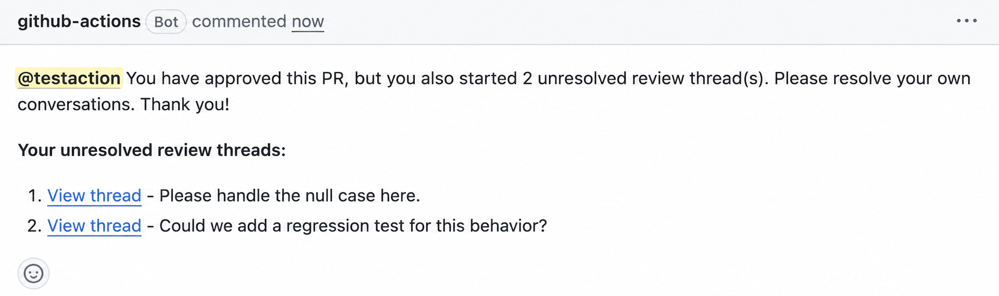

# Notify Approver of Unresolved Threads

A GitHub Action that reminds reviewers to resolve their open review threads after approving a pull request, especially when branch rules require all conversations to be resolved before merging.

## Features

- ✅ Checks for unresolved review threads started by the approving reviewer
- ✅ Posts a reminder comment with links to those threads
- ✅ Supports configurable wait times and comment templates
- ✅ Handles pagination for reviews and threads

## How it works

1. Triggers when a PR review is **submitted**.
2. Skips immediately unless the submitted review is `approved`.
3. Waits `wait-seconds` after an approved review is submitted.
4. Re-fetches the reviewer's reviews with pagination and skips if their latest submitted review is no longer `APPROVED`.
5. Fetches all review threads with pagination and keeps unresolved threads started by the approving reviewer.
6. Posts a comment only when unresolved threads are found.

## Example reminder comment

The action posts a reminder when an approving reviewer has unresolved threads they started:



## Usage

### Basic Usage

```yaml
name: Check Unresolved Threads

on:
  pull_request_review:
    types: [submitted]

permissions:
  contents: read
  pull-requests: write

jobs:
  notify:
    runs-on: ubuntu-latest
    steps:
      - uses: kreuz123/notify-unresolved-threads-action@main
```

### Configuring the wait time and customizing the comment

Use `wait-seconds` to control how long the action waits before checking threads. The default is `45` seconds; set it to `0` to check immediately.

Use `comment-template` to customize the reminder comment. The template supports the following placeholders:

- `{reviewer}` — always renders as an `@mention` so the reviewer is notified. If omitted from your template, the mention is prepended automatically.
- `{unresolvedCount}` — the number of unresolved threads.
- `{threadList}` — the list of unresolved threads. If omitted from your template, the thread list is appended automatically so it's never lost.

```yaml
steps:
  - uses: kreuz123/notify-unresolved-threads-action@main
    with:
      wait-seconds: 60
      comment-template: |
        Please resolve your {unresolvedCount} open conversation(s) before we can merge.

        {threadList}
```

## Inputs

| Name               | Required | Default               | Description                                                                                                                               |
| ------------------ | -------- | --------------------- | ----------------------------------------------------------------------------------------------------------------------------------------- |
| `token`            | No       | `${{ github.token }}` | Token used to read threads and post the comment. Override only for a PAT or GitHub App token.                                             |
| `wait-seconds`     | No       | `45`                  | Seconds to wait before checking threads. Set to `0` to check immediately.                                                                  |
| `comment-template` | No       | See `action.yml`      | Template for the reminder comment using `{reviewer}`, `{unresolvedCount}`, and `{threadList}`.                                           |

## Outputs

| Name              | Description                                                      |
| ----------------- | ---------------------------------------------------------------- |
| `reviewer`        | Username of the reviewer who approved.                          |
| `unresolvedCount` | Number of unresolved threads started by the reviewer.            |
| `threadList`      | Markdown-formatted list of unresolved threads (empty when none). |

## Required permissions

The workflow's `GITHUB_TOKEN` needs:

- `pull-requests: write` — to read review threads and post the reminder comment.

## License

This project is licensed under the [MIT License](LICENSE).
